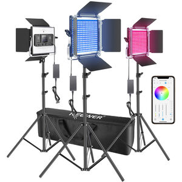

# neewerserver



Neewer Lights are RGB LED panels supposed to be controled with a Neewer App on
your mobile phone (iOS / Android). The official App connects to the devices with
Bluetooth Low Energy (BLE) and allows the user to change the color, mode,
luminosity, play a specific program, etc.

We wanted to be able to use those panels in an audio/midi reactive setup for
visual perfomances, triggered by MIDI events or audio in real time (from
Touchdesigner or any other visual software). We analyzed the BLE messages
and implemented a small server to reproduce the app behavior and send our own
messages to the device.

### What this server does

Connects to a Neewer RGB Light using its mac address. Listens to incoming UDP
messages and forward them to the light panel with BLE. You can produce the
UDP messages from Touchdesigner ask the light to change it's color or
luminosity in real time.

### Install

```
git clone https://github.com/null-part/neewerserver.git
cd neewerserver
pip install --user -r requirements.txt
```

### Usage

```
usage: neewerserver.py [-h] [-a UDP_LISTEN_ADDR] [-p UDP_LISTEN_PORT] [-l] [-c COMMAND] -m MAC_ADDRESS

optional arguments:
  -h, --help            show this help message and exit
  -a UDP_LISTEN_ADDR, --udp_listen_addr UDP_LISTEN_ADDR
                        Address to use for the UDP server. Default: 0.0.0.0
  -p UDP_LISTEN_PORT, --udp_listen_port UDP_LISTEN_PORT
                        Port to use for the UDP server Default: 1664
  -l, --list_commands   List available commands
  -c COMMAND, --command COMMAND
                        Command to execute. Available commands: scan, serve (default: serve)
  -m MAC_ADDRESS, --mac_address MAC_ADDRESS
                        Device mac address. Must be set.
```

You can detect the BLE handle to use thanks to the `scan` command

Example:

```
./neewerserver.py -m 'DD:9D:97:26:40:00' -c scan
./neewerserver.py -m 'DD:9D:97:26:40:00'
```

### Issues

This is an expimental project. Use at your own risk.

The server may disconnect from the light after some time, you may want to restart
the server to reassociate to the device.

BLE latency is quite acceptable. If you experience packet drop, try to get
closer to your light panel. We also had some issues with a mobile client
connected as the same time as neewerserver.

### Authors

Baked with love and suffering by [killiantimsit](https://github.com/killiantimsit)
and [schematicwizard](https://github.com/uZer)
